# RELEARN_C
**C语言给了你穿越抽象假象的力量，将你从愚昧中解放出来。**

## prac0

无压力，我就是在Linux真机上开发的。

## prac1

```
make ex1
CFLAGS="-Wall" make ex1
man 3 puts
```

## prac2

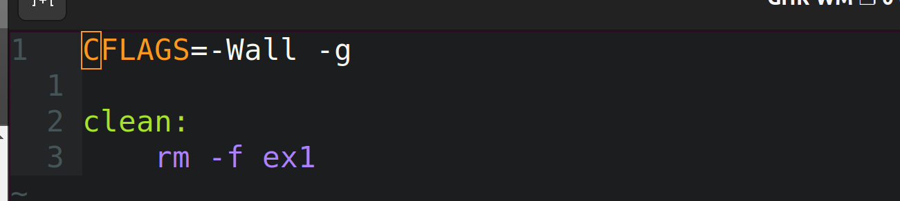

```
永远记住要缩进，以及如果你得到了像这种奇奇怪怪的错误，应该复查你是否都使用了 TAB 字符，由于一些make的变种十分挑剔。
$ make clean
Makefile:4: *** missing separator.  Stop.
man make
man cc
cc=gcc(?)
which cc
```

## prac3

No comments

## parc4

什么是valgrind？

这个可以用apt install安装，但是人家推荐：

```
# 1) Download it (use wget if you don't have curl)
curl -O http://valgrind.org/downloads/valgrind-3.6.1.tar.bz2

# use md5sum to make sure it matches the one on the site
md5sum valgrind-3.6.1.tar.bz2

# 2) Unpack it.
tar -xjvf valgrind-3.6.1.tar.bz2

# cd into the newly created directory
cd valgrind-3.6.1

# 3) configure it
./configure

# 4) make it
make

# 5) install it (need root)
sudo make install
```

下载下来的文件没法用，是个错误文件，放弃。

```
valgrind-3.6.1.tar.bz2
➜  valgrind bzip2 -df valgrind-3.6.1.tar.bz2
➜  valgrind tar -xvf valgrind-3.6.1.tar
tar: This does not look like a tar archive
tar: Exiting with failure status due to previous errors
➜  valgrind xo .
➜  valgrind
```

```
sudo apt install valgrind
sudo apt install aptitude
sudo aptitude install valgrind
先n再y，降级一些软件包
```

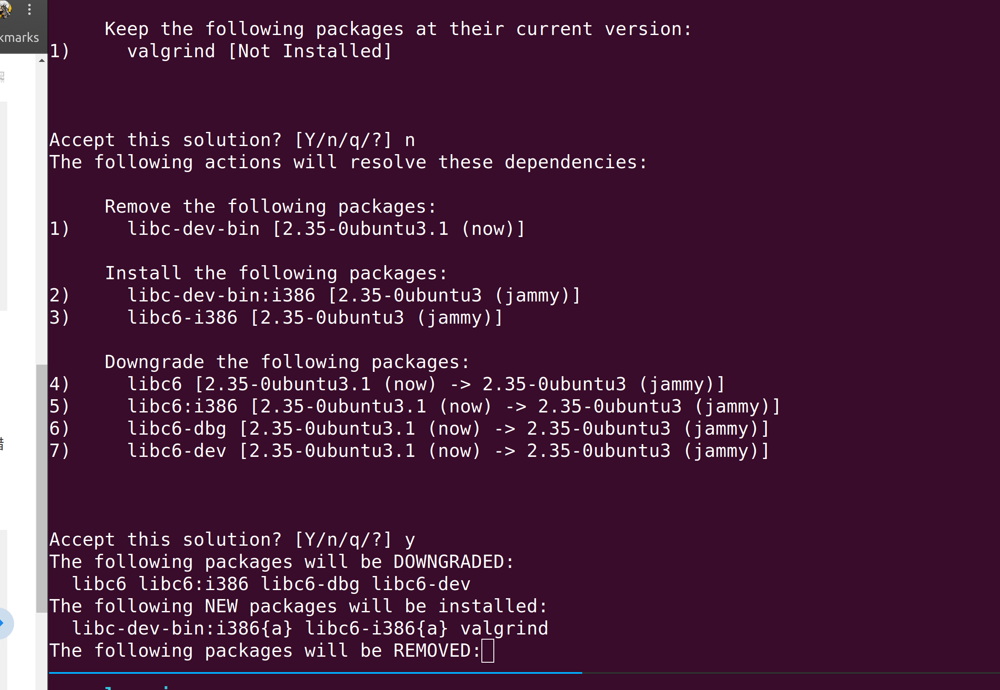

> - 无论什么时候你运行C程序并且使它工作，都应该使用`Valgrind`重新运行它来检查。
> - 对于得到的每个错误，找到“源码:行数”提示的位置，然后修复它。你可以上网搜索错误信息，来弄清楚它的意思。
> - 一旦你的程序在`Valgrind`下不出现任何错误信息，应该就好了。你可能学会了如何编写代码的一些技巧。

**注意：我设了一个vg的alias，意思是valgrind**

## ex5

No comments

## ex6

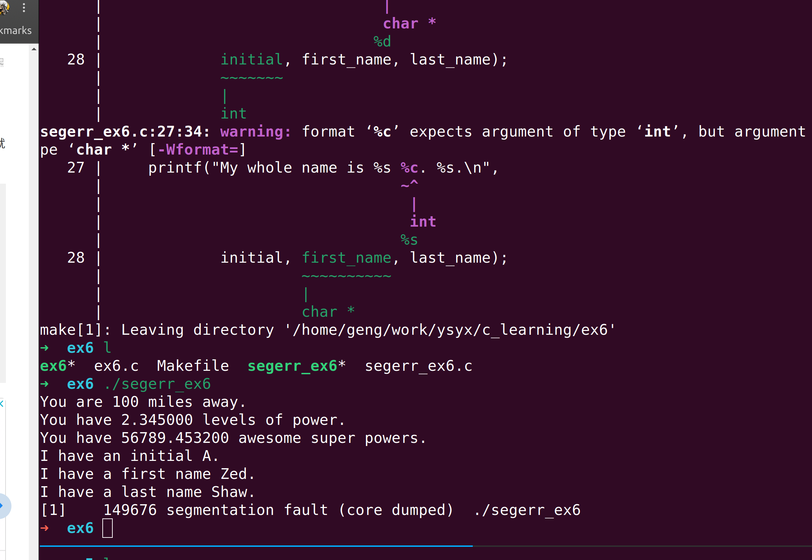

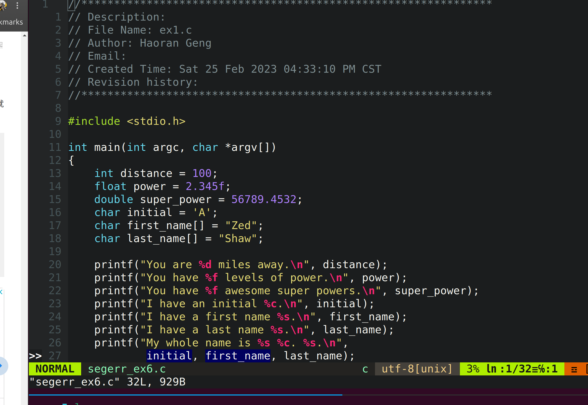

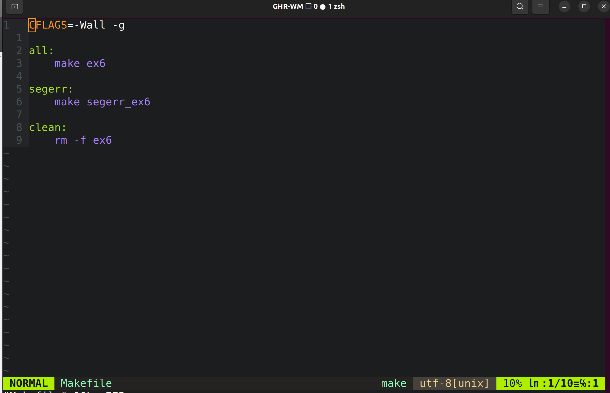

## ex7

no comments

## ex8

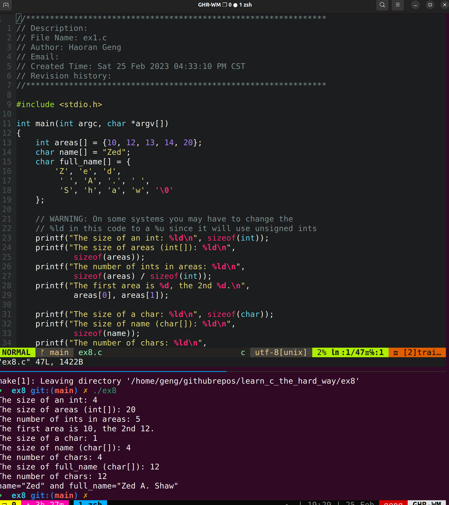

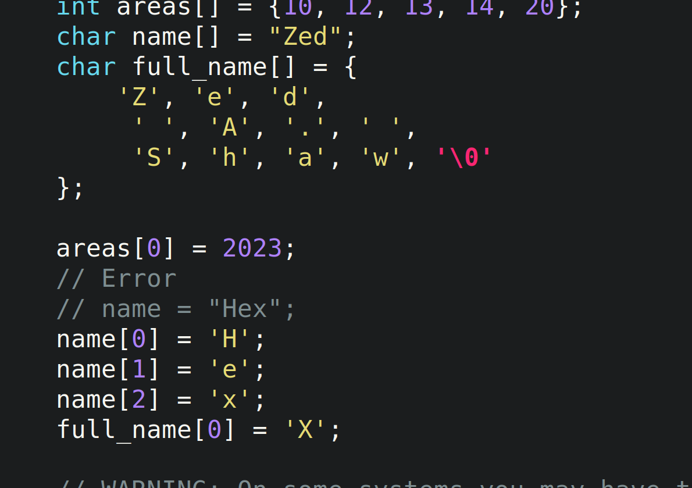

## ex9

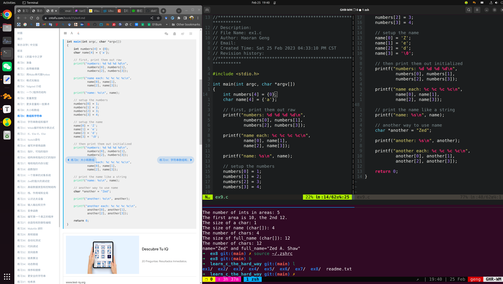

第一次遇到不确定的

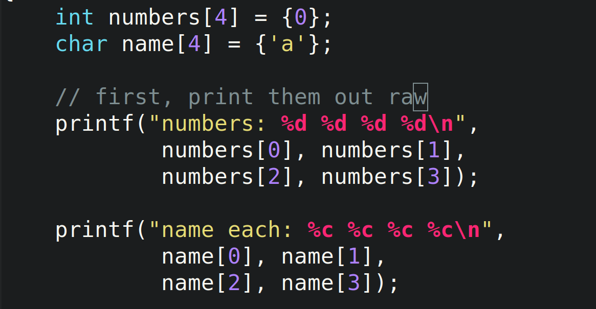

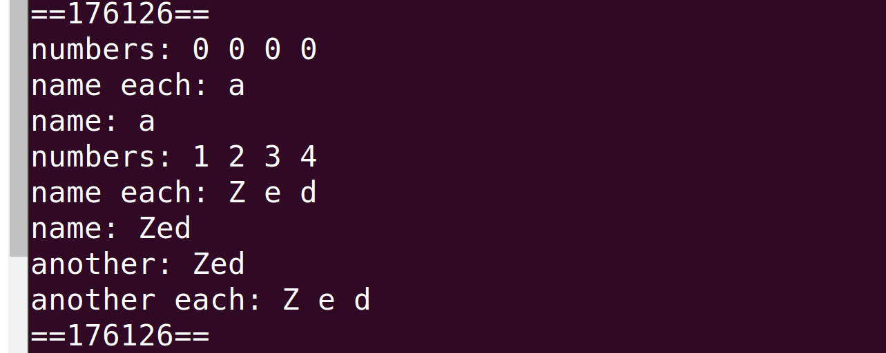

这说明了很多问题

C初始化int数组的时候，如果设{0}，那就是全部初始化为0，如果设其他的，那就是第一个是那个其他的，其他的还是0.如下：

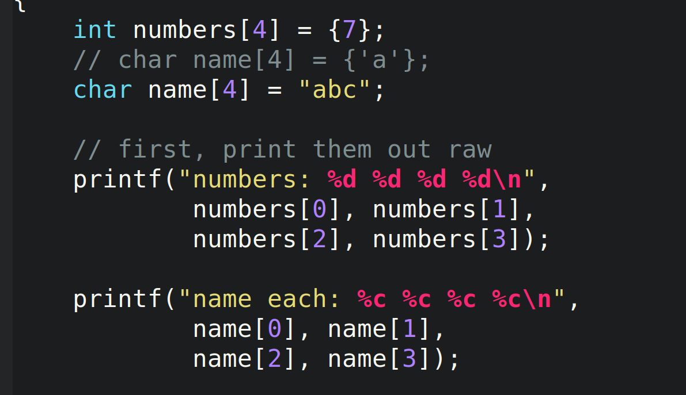

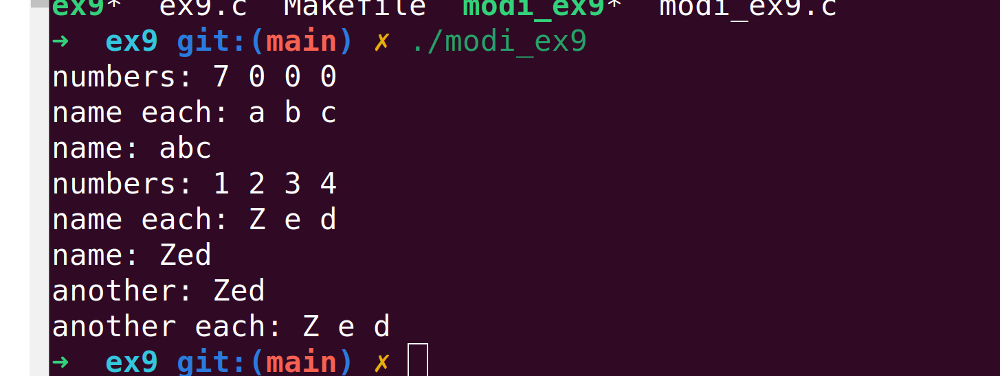

## ex10

- 查询`NULL`是什么东西，尝试将它用做`states`的一个元素，看看它会打印出什么。

**NULL是个空指针**。

- 看看你是否能在打印之前将`states`的一个元素赋值给`argv`中的元素，再试试相反的操作。

可以的

argc是argv中字符的个数，argv是一个字符串的数组。

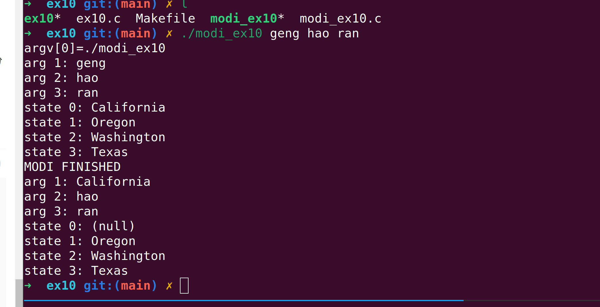

## ex11

no comments

## ex12

no comments

## ex13

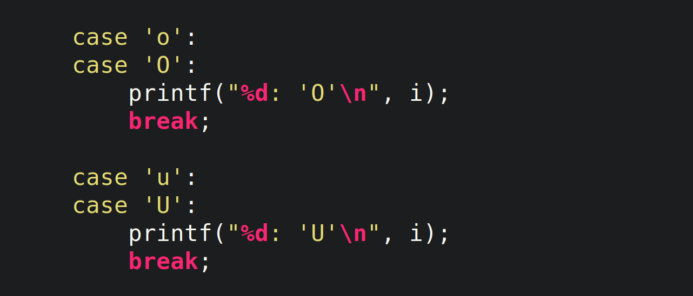

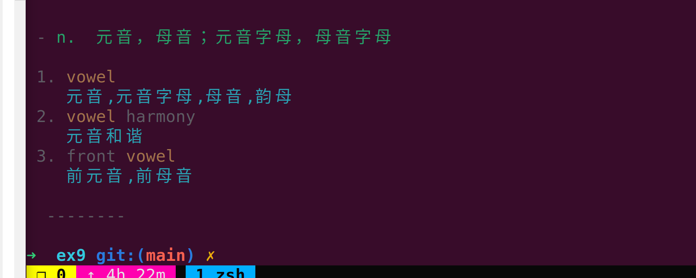

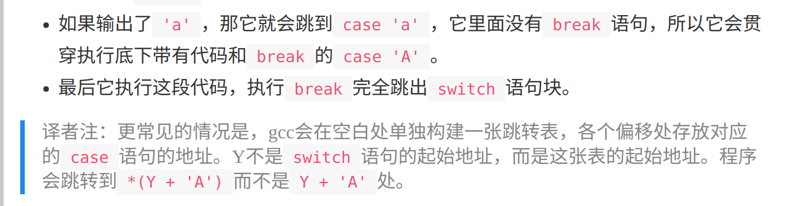

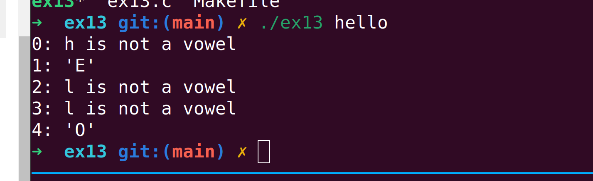

**大写转小写的用法**

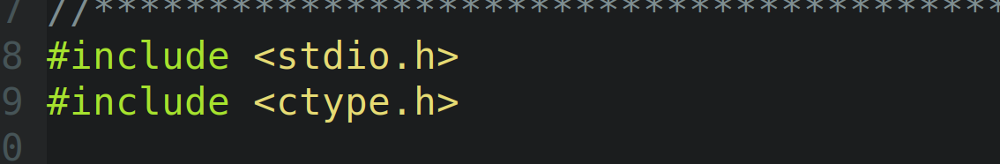

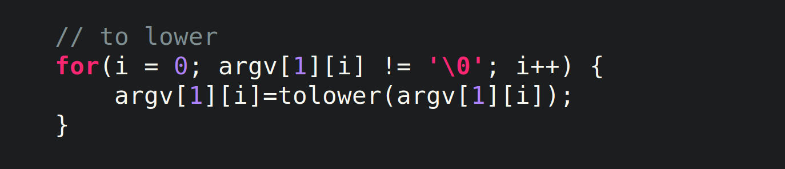

## ex14

主要是用到了ctype.h里面的isprint函数。

函数	功能
isalnum	检查 ch 是否为字母或数字
isalpha	检查 ch 是否为字母
isblank (C++11 only)	检查 ch 是否为’\t’ 或 ’ ’
iscntrl	检查 ch 是否为控制字符（ ASCII值在 0 ~ 31）
isdigit	检查 ch 是否为数字（ ‘0’ ~ ‘9’ ）
isgraph	检查 ch 是否为可显示字符，不包括空格
islower	检查 ch 是否为小写字母（‘a’ ~ ‘z’）
isprint	检查 ch 是否为可打印字符，包括空格
ispunct	检查 ch 是否为标点字符，即除字母，数字和空格以外的所有可打印字符
isspace	检查 ch 是否为 ’ ', ‘\t’, ‘\n’, ‘\v’, ‘\f’, ‘\r’
isupper	检查 ch 是否为大写字母（‘A’ ~ ‘Z’）
isxdigit	检查 ch 是否为一个 16 进制的数学字符（即 ‘0’ ~ ‘9’ 或 ‘A’ ~ ‘F’ 或 ‘a’ - ‘f’）
tolower	将 ch 字符转换成小写字母
toupper	将 ch 字符转换成大写字母
————————————————
版权声明：本文为CSDN博主「ultraji」的原创文章，遵循CC 4.0 BY-SA版权协议，转载请附上原文出处链接及本声明。
原文链接：https://blog.csdn.net/qq_23827747/article/details/79705576

## ex15

重要：指针语料库

现在我打算向你提供一个词库，用于读写指针。当你遇到复杂的指针语句时，试着参考它并且逐字拆分语句（或者不要使用这个语句，因为有可能并不好）：

```
type *ptr
```

`type`类型的指针，名为`ptr`。

```
*ptr
```

`ptr`所指向位置的值。

```
*(ptr + i)
```

（`ptr`所指向位置加上`i`）的值。

> 译者注：以字节为单位的话，应该是`ptr`所指向的位置再加上`sizeof(type) * i`。

```
&thing
```

`thing`的地址。

```
type *ptr = &thing
```

名为`ptr`，`type`类型的指针，值设置为`thing`的地址。

```
ptr++
```

自增`ptr`指向的位置。

我们将会使用这份简单的词库来拆解这本书中所有的指针用例。

无论怎么样，你都不应该把指针和数组混为一谈。它们并不是相同的东西，即使C让你以一些相同的方法来使用它们。例如，如果你访问上面代码中的`sizeof(cur_age)`，你会得到指针的大小，而不是它指向数组的大小。如果你想得到整个数组的大小，你应该使用数组的名称`age`，就像第12行那样。

> 译者注，除了`sizeof`、`&`操作和声明之外，数组名称都会被编译器推导为指向其首个元素的指针。对于这些情况，不要用“是”这个词，而是要用“推导”。

另外，如果要打印指针，应该使用printf `%p`

**特别注意，即使i在自增1，指针也不是自增1，好像是自增sizeof(xx)**

代码：

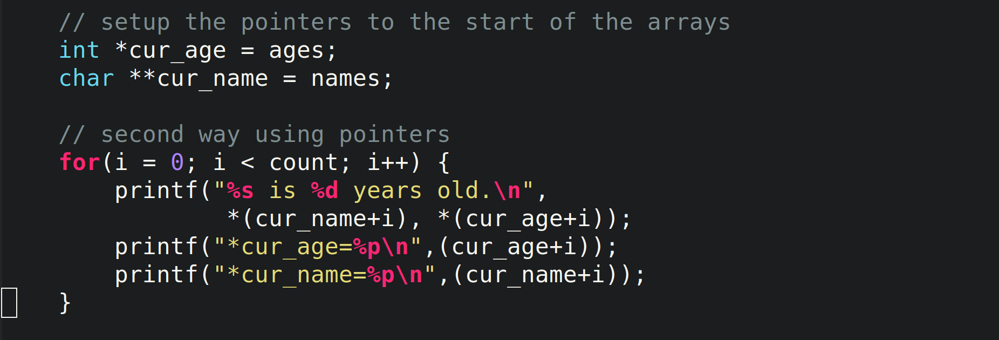

输出：

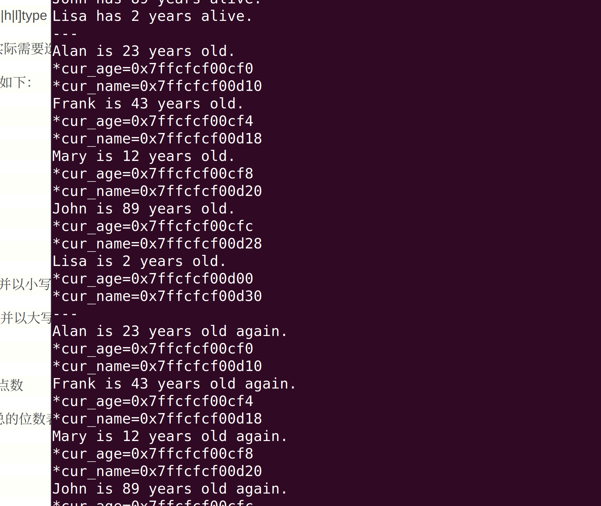

## ex16

**更新了一个5年前的仓库，不忘初心**

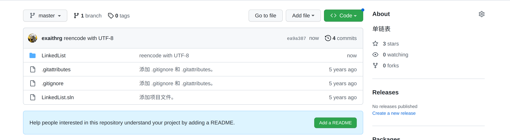

一些使用struct的模板：

```c
#include <stdio.h>
#include <assert.h>
#include <stdlib.h>
#include <string.h>

struct Person {
    char *name;
    int age;
    int height;
    int weight;
};

struct Person *Person_create(char *name, int age, int height, int weight)
{
    struct Person *who = malloc(sizeof(struct Person));
    assert(who != NULL);

    who->name = strdup(name);
    who->age = age;
    who->height = height;
    who->weight = weight;

    return who;
}

void Person_destroy(struct Person *who)
{
    assert(who != NULL);

    free(who->name);
    free(who);
}

void Person_print(struct Person *who)
{
    printf("Name: %s\n", who->name);
    printf("\tAge: %d\n", who->age);
    printf("\tHeight: %d\n", who->height);
    printf("\tWeight: %d\n", who->weight);
}

int main(int argc, char *argv[])
{
    // make two people structures
    struct Person *joe = Person_create(
            "Joe Alex", 32, 64, 140);

    struct Person *frank = Person_create(
            "Frank Blank", 20, 72, 180);

    // print them out and where they are in memory
    printf("Joe is at memory location %p:\n", joe);
    Person_print(joe);

    printf("Frank is at memory location %p:\n", frank);
    Person_print(frank);

    // make everyone age 20 years and print them again
    joe->age += 20;
    joe->height -= 2;
    joe->weight += 40;
    Person_print(joe);

    frank->age += 20;
    frank->weight += 20;
    Person_print(frank);

    // destroy them both so we clean up
    Person_destroy(joe);
    Person_destroy(frank);

    return 0;
}
```

## ex17

这个是真看不懂

```
errno是一个全局关键字好像，记录错误代码
perror应该是个系统函数
Connection是一个struct，里面有个文件指针和一个Database，意为一一对应关系
rewind是什么玩意
fwrite的参数什么意思
fflush什么意思
为什么能用下面的语法
    for(i = 0; i < MAX_ROWS; i++) {
        // make a prototype to initialize it
        struct Address addr = {.id = i, .set = 0};
        // then just assign it
        conn->db->rows[i] = addr;
    }
用于错误报告的 errno和perror

当函数返回了一个错误时，它通常设置一个叫做errno的“外部”变量，来描述发生了什么错误。它们只是数字，所以你可以使用perror来“打印出错误信息”。
文件函数

我使用了一些新的函数，比如fopen，fread，fclose，和rewind来处理文件。这些函数中每个都作用于FILE结构体上，就像你的结构体似的，但是它由C标准库定义。

嵌套结构体指针

你应该学习这里的嵌套结构器和获取数组元素地址的用法，它读作“读取db中的conn中的rows的第i个元素，并返回地址（&）”。


```


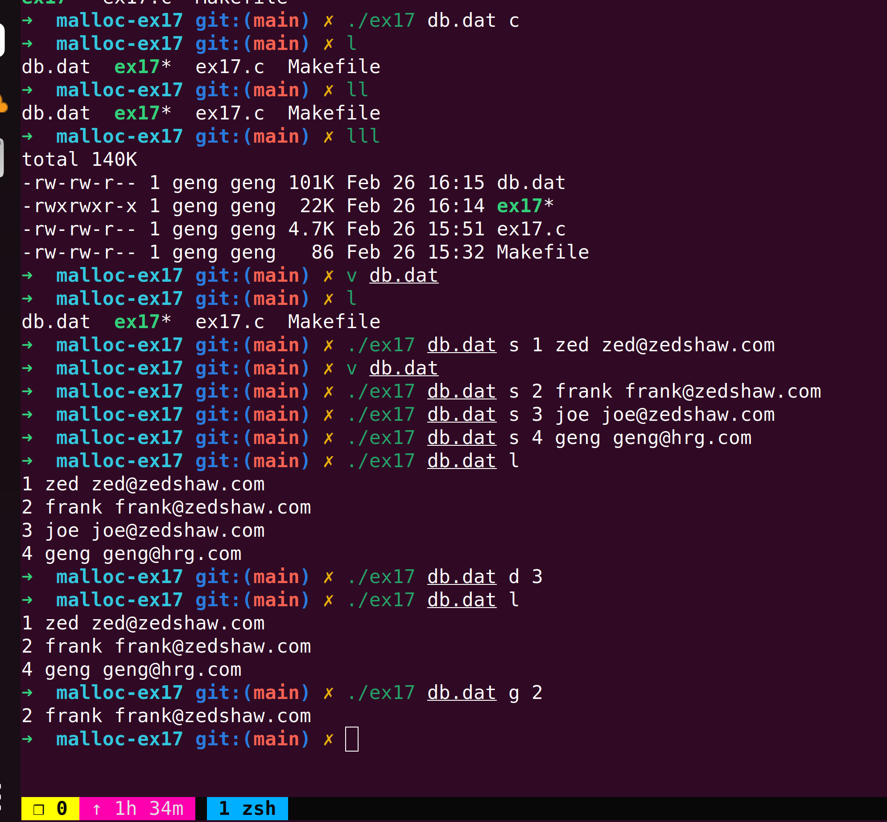

理清内存的最简单的方式是遵守这条原则：如果你的变量并不是从`malloc`中获取的，也不是从一个从`malloc`获取的函数中获取的，那么它在栈上。

## ex18

重要解释：https://www.jianshu.com/p/a63b9575c86a

函数指针的格式类似这样：

```c
int (*POINTER_NAME)(int a, int b)
```

记住如何编写它的一个方法是：

- 编写一个普通的函数声明：`int callme(int a, int b)`
- 将函数用指针语法包装：`int (*callme)(int a, int b)`
- 将名称改成指针名称：`int (*compare_cb)(int a, int b)`

这个方法的关键是，当你完成这些之后，指针的变量名称为`compare_cb`，而你可以将它用作函数。这类似于指向数组的指针可以表示所指向的数组。指向函数的指针也可以用作表示所指向的函数，只不过是不同的名字。

```c
int (*tester)(int a, int b) = sorted_order;
printf("TEST: %d is same as %d\n", tester(2, 3), sorted_order(2, 3));
```

即使是对于返回指针的函数指针，上述方法依然有效：

- 编写：`char *make_coolness(int awesome_levels)`
- 包装：`char *(*make_coolness)(int awesome_levels)`
- 重命名：`char *(*coolness_cb)(int awesome_levels)`

**函数指针最核心的东西：可以把函数当成一个类型来传入另一个函数，并在另一个函数里面用。**

```c
// a typedef creates a fake type, in this
// case for a function pointer
// Example: typedef int myint_t
//这个是定义一个类型，从此所有(int a, int b)的函数都可以叫compare_cb类型了，例如sorted_order，reverse_oreder,strange_order都可以用compare_cb传入函数体内。
typedef int (*compare_cb)(int a, int b);


/**
 * A classic bubble sort function that uses the
 * compare_cb to do the sorting.
 */
int *bubble_sort(int *numbers, int count, compare_cb cmp)
{
    int temp = 0;
    int i = 0;
    int j = 0;
    int *target = malloc(count * sizeof(int));

    if(!target) die("Memory error.");

    memcpy(target, numbers, count * sizeof(int));

    for(i = 0; i < count; i++) {
        for(j = 0; j < count - 1; j++) {
            if(cmp(target[j], target[j+1]) > 0) {
                temp = target[j+1];
                target[j+1] = target[j];
                target[j] = temp;
            }
        }
    }

    return target;
}

```

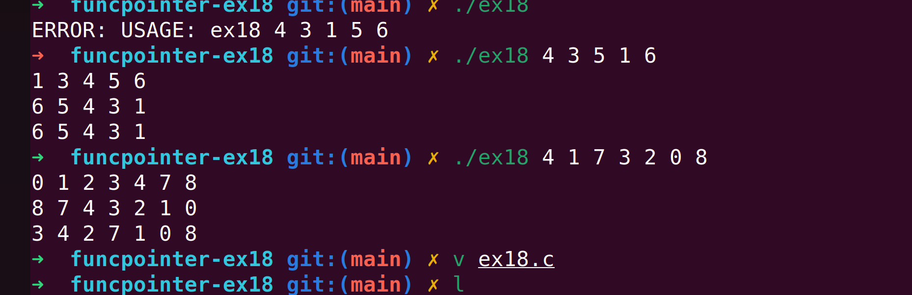

重要解释：https://www.jianshu.com/p/a63b9575c86a

> 最后，你会看到`compare_cb`函数指针的`typedef`是如何使用的。我仅仅传递了`sorted_order`、`reverse_order`和`strange_order`的名字作为函数来调用`test_sorting`。C编译器会找到这些函数的地址，并且生成指针用于`test_sorting`。如果你看一眼`test_sorting`你会发现它把这些函数传给了`bubble_sort`，并不关心它们是做了什么。只要符合`compare_cb`原型的东西都有效。

## ex20

这个是Zed的调试宏。

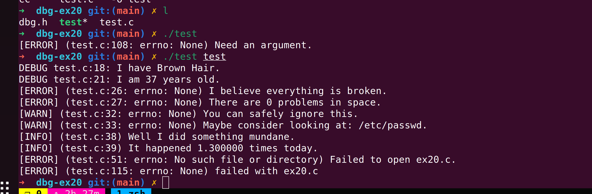

说实话，看的不是很懂，也不怎么会使

**等下，这个好强啊，这个可以直接显示行号的，这个也太离谱了**

**可以直接把这些宏当成printf用，这也太爽了**。


## ex28

这个是Makefile进阶，感觉是很重要的东西

**项目构建完毕了**。


## ex29

这个是必须做的，否则不能做ex32。

注意，他这个的核心是如何修改Makefile和test，看看我的改法：

```shell
Makefile:
# TARGET=build/libYOUR_LIBRARY.a
TARGET=build/libex29.a
SO_TARGET=$(patsubst %.a,%.so,$(TARGET))

tests/
    then
        if $VALGRIND ./$i build/libex29.so print_a_message "hello" 2>> tests/tests.log
        then
            echo $i PASS
```


## ex30

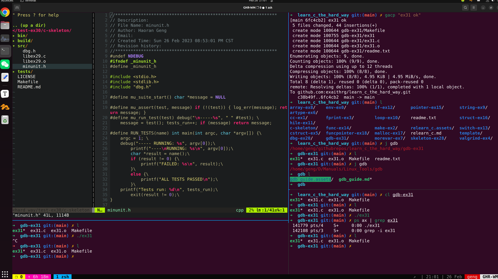

## ex31

详见

```
➜  gdb-ex31 git:(main) ✗ j gdb
/home/geng/D/Manuals/Linux_Tools/gdb
➜  gdb l
gdb_guide.assets/  gdb_guide.md*
➜  gdb
```

## ex32

报错：

```shell
➜  liblcthw git:(main) ✗ make clean
rm -rf build src/lcthw/list.o tests/list_tests
rm -f tests/tests.log
find . -name "*.gc*" -exec rm {} \;
rm -rf `find . -name "*.dSYM" -print`
➜  liblcthw git:(main) ✗ make
cc -g -O2 -Wall -Wextra -Isrc -rdynamic -DNDEBUG  -fPIC   -c -o src/lcthw/list.o src/lcthw/list.c
ar rcs build/liblcthw.a src/lcthw/list.o
ranlib build/liblcthw.a
cc -shared -o build/liblcthw.so src/lcthw/list.o
cc -g -O2 -Wall -Wextra -Isrc -rdynamic -DNDEBUG  build/liblcthw.a    tests/list_tests.c   -o tests/list_tests
In file included from tests/list_tests.c:9:
tests/list_tests.c: In function ‘main’:
tests/minunit.h:23:38: warning: parameter ‘argc’ set but not used [-Wunused-but-set-parameter]
   23 | #define RUN_TESTS(name) int main(int argc, char *argv[]) {\
      |                                  ~~~~^~~~
tests/list_tests.c:121:1: note: in expansion of macro ‘RUN_TESTS’
  121 | RUN_TESTS(all_tests);
      | ^~~~~~~~~
/usr/bin/ld: /tmp/cc2k8dv9.o: in function `test_create':
/home/geng/githubrepos/learn_c_the_hard_way/liblcthw/tests/list_tests.c:21: undefined reference to `List_create'
/usr/bin/ld: /tmp/cc2k8dv9.o: in function `test_destroy':
/home/geng/githubrepos/learn_c_the_hard_way/liblcthw/tests/list_tests.c:30: undefined reference to `List_clear_destroy'
/usr/bin/ld: /tmp/cc2k8dv9.o: in function `test_push_pop':
/home/geng/githubrepos/learn_c_the_hard_way/liblcthw/tests/list_tests.c:39: undefined reference to `List_push'
/usr/bin/ld: /home/geng/githubrepos/learn_c_the_hard_way/liblcthw/tests/list_tests.c:42: undefined reference to `List_push'
/usr/bin/ld: /home/geng/githubrepos/learn_c_the_hard_way/liblcthw/tests/list_tests.c:45: undefined reference to `List_push'
/usr/bin/ld: /home/geng/githubrepos/learn_c_the_hard_way/liblcthw/tests/list_tests.c:49: undefined reference to `List_pop'
/usr/bin/ld: /home/geng/githubrepos/learn_c_the_hard_way/liblcthw/tests/list_tests.c:52: undefined reference to `List_pop'
/usr/bin/ld: /home/geng/githubrepos/learn_c_the_hard_way/liblcthw/tests/list_tests.c:55: undefined reference to `List_pop'
/usr/bin/ld: /tmp/cc2k8dv9.o: in function `test_unshift':
/home/geng/githubrepos/learn_c_the_hard_way/liblcthw/tests/list_tests.c:64: undefined reference to `List_unshift'
/usr/bin/ld: /home/geng/githubrepos/learn_c_the_hard_way/liblcthw/tests/list_tests.c:67: undefined reference to `List_unshift'
/usr/bin/ld: /home/geng/githubrepos/learn_c_the_hard_way/liblcthw/tests/list_tests.c:70: undefined reference to `List_unshift'
/usr/bin/ld: /tmp/cc2k8dv9.o: in function `test_remove':
/home/geng/githubrepos/learn_c_the_hard_way/liblcthw/tests/list_tests.c:82: undefined reference to `List_remove'
/usr/bin/ld: /tmp/cc2k8dv9.o: in function `test_shift':
/home/geng/githubrepos/learn_c_the_hard_way/liblcthw/tests/list_tests.c:96: undefined reference to `List_shift'
/usr/bin/ld: /home/geng/githubrepos/learn_c_the_hard_way/liblcthw/tests/list_tests.c:99: undefined reference to `List_shift'
/usr/bin/ld: /tmp/cc2k8dv9.o: in function `test_destroy':
/home/geng/githubrepos/learn_c_the_hard_way/liblcthw/tests/list_tests.c:30: undefined reference to `List_clear_destroy'
collect2: error: ld returned 1 exit status
make: *** [<builtin>: tests/list_tests] Error 1
➜  liblcthw git:(main) ✗ l
bin/  build/  LICENSE  Makefile  README.md  src/  tests/
➜  liblcthw git:(main) ✗ v
➜  liblcthw git:(main) ✗ l
bin/  build/  LICENSE  Makefile  README.md  src/  tests/
➜  liblcthw git:(main) ✗ make
ar rcs build/liblcthw.a src/lcthw/list.o
ranlib build/liblcthw.a
cc -shared -o build/liblcthw.so src/lcthw/list.o
cc -g -O2 -Wall -Wextra -Isrc -rdynamic -DNDEBUG  build/liblcthw.a    tests/list_tests.c   -o tests/list_tests
In file included from tests/list_tests.c:9:
tests/list_tests.c: In function ‘main’:
tests/minunit.h:23:38: warning: parameter ‘argc’ set but not used [-Wunused-but-set-parameter]
   23 | #define RUN_TESTS(name) int main(int argc, char *argv[]) {\
      |                                  ~~~~^~~~
tests/list_tests.c:121:1: note: in expansion of macro ‘RUN_TESTS’
  121 | RUN_TESTS(all_tests);
      | ^~~~~~~~~
/usr/bin/ld: /tmp/ccFAPThM.o: in function `test_create':
/home/geng/githubrepos/learn_c_the_hard_way/liblcthw/tests/list_tests.c:21: undefined reference to `List_create'
/usr/bin/ld: /tmp/ccFAPThM.o: in function `test_destroy':
/home/geng/githubrepos/learn_c_the_hard_way/liblcthw/tests/list_tests.c:30: undefined reference to `List_clear_destroy'
/usr/bin/ld: /tmp/ccFAPThM.o: in function `test_push_pop':
/home/geng/githubrepos/learn_c_the_hard_way/liblcthw/tests/list_tests.c:39: undefined reference to `List_push'
/usr/bin/ld: /home/geng/githubrepos/learn_c_the_hard_way/liblcthw/tests/list_tests.c:42: undefined reference to `List_push'
/usr/bin/ld: /home/geng/githubrepos/learn_c_the_hard_way/liblcthw/tests/list_tests.c:45: undefined reference to `List_push'
/usr/bin/ld: /home/geng/githubrepos/learn_c_the_hard_way/liblcthw/tests/list_tests.c:49: undefined reference to `List_pop'
/usr/bin/ld: /home/geng/githubrepos/learn_c_the_hard_way/liblcthw/tests/list_tests.c:52: undefined reference to `List_pop'
/usr/bin/ld: /home/geng/githubrepos/learn_c_the_hard_way/liblcthw/tests/list_tests.c:55: undefined reference to `List_pop'
/usr/bin/ld: /tmp/ccFAPThM.o: in function `test_unshift':
/home/geng/githubrepos/learn_c_the_hard_way/liblcthw/tests/list_tests.c:64: undefined reference to `List_unshift'
/usr/bin/ld: /home/geng/githubrepos/learn_c_the_hard_way/liblcthw/tests/list_tests.c:67: undefined reference to `List_unshift'
/usr/bin/ld: /home/geng/githubrepos/learn_c_the_hard_way/liblcthw/tests/list_tests.c:70: undefined reference to `List_unshift'
/usr/bin/ld: /tmp/ccFAPThM.o: in function `test_remove':
/home/geng/githubrepos/learn_c_the_hard_way/liblcthw/tests/list_tests.c:82: undefined reference to `List_remove'
/usr/bin/ld: /tmp/ccFAPThM.o: in function `test_shift':
/home/geng/githubrepos/learn_c_the_hard_way/liblcthw/tests/list_tests.c:96: undefined reference to `List_shift'
/usr/bin/ld: /home/geng/githubrepos/learn_c_the_hard_way/liblcthw/tests/list_tests.c:99: undefined reference to `List_shift'
/usr/bin/ld: /tmp/ccFAPThM.o: in function `test_destroy':
/home/geng/githubrepos/learn_c_the_hard_way/liblcthw/tests/list_tests.c:30: undefined reference to `List_clear_destroy'
collect2: error: ld returned 1 exit status
make: *** [<builtin>: tests/list_tests] Error 1

```

**Refs:**

https://github.com/preslavmihaylov/learn-c-the-hard-way

https://github.com/abemassry/learn-c-the-hard-way


## ex33

**花了我4个小时。只给结果。**

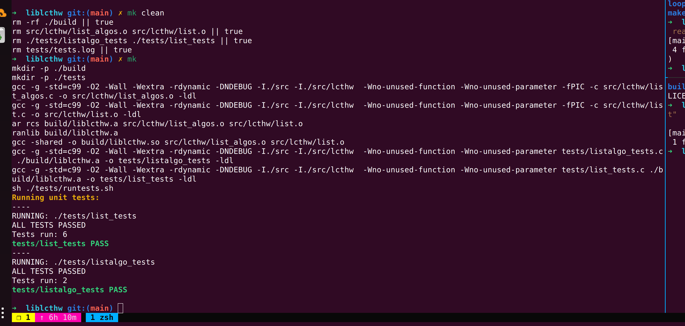


## ex42


## ex44


# Appendix

## Episode：安装valgrind

注意，千万不要用南大源安装valgrind，南大源没有更新ubuntu3.1，如果强行用aptitude n+y安装，会导致libc6的降级，后果是重启后无法改变屏幕分辨率。


出现上述问题完全是因为南大源比较垃圾，他没有针对2.35-0ubuntu3.1的valgrind，关键我又自作聪明的用aptitude强行降级已有的包，造成了各种驱动的不一致，最终后果就是电脑重启之后4K屏检测不到了，分辨率只有1024x768.

**PS**：不是南大源的问题，应该先保证你的南大源写法写对了，应该如下写：

```shell
#deb cdrom:[Ubuntu 22.04 LTS _Jammy Jellyfish_ - Release amd64 (20220419)]/ jammy main restricted

# See http://help.ubuntu.com/community/UpgradeNotes for how to upgrade to
# newer versions of the distribution.
deb http://mirrors.nju.edu.cn/ubuntu/ jammy main restricted
# deb-src http://mirrors.nju.edu.cn/ubuntu/ jammy main restricted

## Major bug fix updates produced after the final release of the
## distribution.
deb http://mirrors.nju.edu.cn/ubuntu/ jammy-updates main restricted
# deb-src http://mirrors.nju.edu.cn/ubuntu/ jammy-updates main restricted

## N.B. software from this repository is ENTIRELY UNSUPPORTED by the Ubuntu
## team. Also, please note that software in universe WILL NOT receive any
## review or updates from the Ubuntu security team.
deb http://mirrors.nju.edu.cn/ubuntu/ jammy universe
# deb-src http://mirrors.nju.edu.cn/ubuntu/ jammy universe
deb http://mirrors.nju.edu.cn/ubuntu/ jammy-updates universe
# deb-src http://mirrors.nju.edu.cn/ubuntu/ jammy-updates universe

## N.B. software from this repository is ENTIRELY UNSUPPORTED by the Ubuntu 
## team, and may not be under a free licence. Please satisfy yourself as to 
## your rights to use the software. Also, please note that software in 
## multiverse WILL NOT receive any review or updates from the Ubuntu
## security team.
deb http://mirrors.nju.edu.cn/ubuntu/ jammy multiverse
# deb-src http://mirrors.nju.edu.cn/ubuntu/ jammy multiverse
deb http://mirrors.nju.edu.cn/ubuntu/ jammy-updates multiverse
# deb-src http://mirrors.nju.edu.cn/ubuntu/ jammy-updates multiverse

## N.B. software from this repository may not have been tested as
## extensively as that contained in the main release, although it includes
## newer versions of some applications which may provide useful features.
## Also, please note that software in backports WILL NOT receive any review
## or updates from the Ubuntu security team.
deb http://mirrors.nju.edu.cn/ubuntu/ jammy-backports main restricted universe multiverse
# deb-src http://mirrors.nju.edu.cn/ubuntu/ jammy-backports main restricted universe multiverse

deb http://mirrors.nju.edu.cn/ubuntu jammy-security main restricted
# deb-src http://mirrors.nju.edu.cn/ubuntu jammy-security main restricted
deb http://mirrors.nju.edu.cn/ubuntu jammy-security universe
# deb-src http://mirrors.nju.edu.cn/ubuntu jammy-security universe
deb http://mirrors.nju.edu.cn/ubuntu jammy-security multiverse
# deb-src http://mirrors.nju.edu.cn/ubuntu jammy-security multiverse

# This system was installed using small removable media
# (e.g. netinst, live or single CD). The matching "deb cdrom"
# entries were disabled at the end of the installation process.
# For information about how to configure apt package sources,
# see the sources.list(5) manual.
```

我之所以版本旧，是因为我之前的sourcelist是这样写的：

```sh
# nju mirror for ubuntu 22.04

# 默认注释了源码镜像以提高 apt update 速度，如有需要可自行取消注释
deb https://mirror.nju.edu.cn/ubuntu/ jammy main restricted universe multiverse
# deb-src https://mirror.nju.edu.cn/ubuntu/ jammy main restricted universe multiverse
# deb-src https://mirror.nju.edu.cn/ubuntu/ jammy-updates main restricted universe multiverse
# deb-src https://mirror.nju.edu.cn/ubuntu/ jammy-backports main restricted universe multiverse
deb https://mirror.nju.edu.cn/ubuntu/ jammy-security main restricted universe multiverse
# deb-src https://mirror.nju.edu.cn/ubuntu/ jammy-security main restricted universe multiverse

# 预发布软件源，不建议启用
# deb https://mirror.nju.edu.cn/ubuntu/ jammy-proposed main restricted universe multiverse
# deb-src https://mirror.nju.edu.cn/ubuntu/ jammy-proposed main restricted universe multiverse

deb http://security.ubuntu.com/ubuntu/ jammy-security multiverse main restricted universe
```

可以看到漏掉了`jammy-updates`，怪不得更新不了。

解决方法是首先到`/etc/apt/`中把源换回cn.ubuntu.arxiv这种源，然后sudo apt upgrade全部升级回ubuntu3.1的libc6，然后sudo apt -u dist-upgrade强行更新所有的NV显卡驱动解决问题。执行过的命令包括：

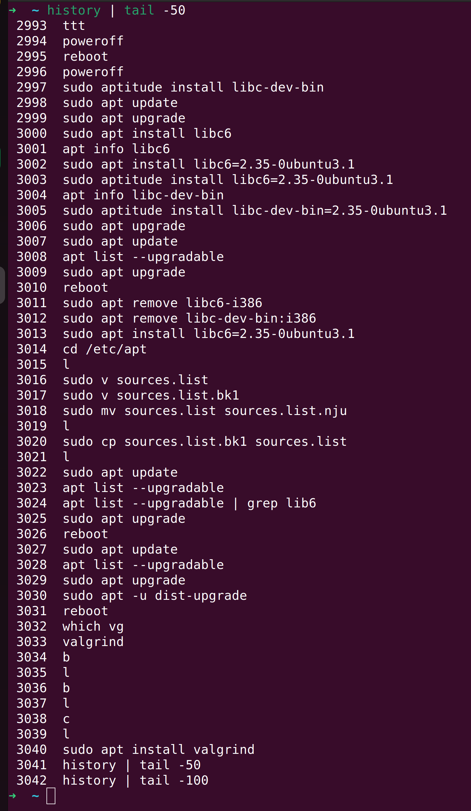

**大概花了一个半小时解决这个没法用我的4K显示器的问题**。又可以愉快的刷题了。

重要命令包括：

```shell
cd /etc/apt
sudo cp sources.list.bk1 sources.list
sudo apt update
apt list --upgradable
sudo apt upgrade
sudo apt -u dist-upgrade
sudo apt install libc6=2.35-0ubuntu3.1(useless)
sudo apt install valgrind
```

PS：Ubuntu官方源已经备份到了我的dotfiles。

PS2：有时候挂着VPN会导致package.microsoft.com和cn.ubuntu.arichive变得更慢，所以如果apt get太慢，可以考虑把v2ray关掉。

## Zed的强大调试宏

https://www.cntofu.com/book/25/ex20.md

**或许可以用于大型C项目的维护工作**

```c
#ifndef __dbg_h__
#define __dbg_h__

#include <stdio.h>
#include <errno.h>
#include <string.h>

#ifdef NDEBUG
#define debug(M, ...)
#else
#define debug(M, ...) fprintf(stderr, "DEBUG %s:%d: " M "\n", __FILE__, __LINE__, ##__VA_ARGS__)
#endif

#define clean_errno() (errno == 0 ? "None" : strerror(errno))

#define log_err(M, ...) fprintf(stderr, "[ERROR] (%s:%d: errno: %s) " M "\n", __FILE__, __LINE__, clean_errno(), ##__VA_ARGS__)

#define log_warn(M, ...) fprintf(stderr, "[WARN] (%s:%d: errno: %s) " M "\n", __FILE__, __LINE__, clean_errno(), ##__VA_ARGS__)

#define log_info(M, ...) fprintf(stderr, "[INFO] (%s:%d) " M "\n", __FILE__, __LINE__, ##__VA_ARGS__)

#define check(A, M, ...) if(!(A)) { log_err(M, ##__VA_ARGS__); errno=0; goto error; }

#define sentinel(M, ...)  { log_err(M, ##__VA_ARGS__); errno=0; goto error; }

#define check_mem(A) check((A), "Out of memory.")

#define check_debug(A, M, ...) if(!(A)) { debug(M, ##__VA_ARGS__); errno=0; goto error; }

#endif
```


## 学习Python

笨办法学python：https://learnpythonthehardway.org/

